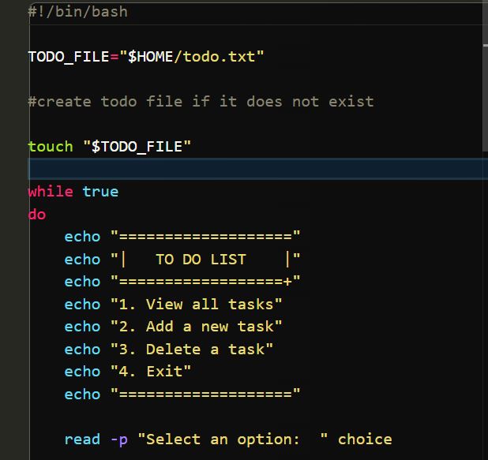
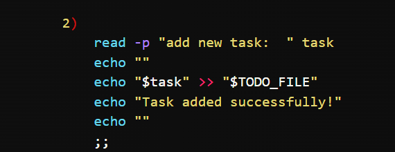
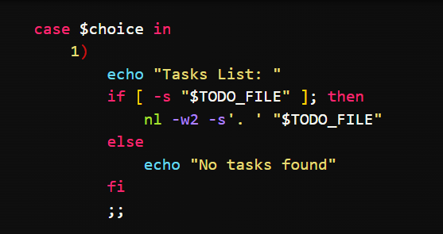
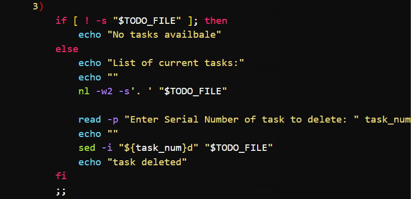

# Shell Fundamentals - To-Do List Manager

## Project Overview

This project is a simple interactive To-Do List Manager built using Bash scripting.

The application allows users to:

- View all tasks
- Add new tasks
- Delete existing tasks
- Exit the application

Tasks are stored in:

```bash
~/todo.txt
```

---

## Requirements Implemented

- Interactive menu system
- Infinite loop until user exits
- Tasks stored in a file
- Numbered task display using `nl`
- Task deletion using `sed -i`
- User input handled using `read`

---

## Running the Script

Make the script executable:

```bash
chmod +x todo.sh
```

Run the script:

```bash
./todo.sh
```

---

## Screenshot 1 - Main Menu



**Description:**  
This screenshot shows the main menu displayed when the script starts. Users can choose to view tasks, add a task, delete a task, or exit the program.

---

## Screenshot 2 - Adding a Task



**Description:**  
This screenshot shows a user entering a new task. The task is saved to `~/todo.txt`.

---

## Screenshot 3 - Viewing Tasks



**Description:**  
This screenshot shows the list of saved tasks displayed with line numbers using the `nl` command.

---

## Screenshot 4 - Deleting a Task



**Description:**  
This screenshot shows a task being deleted by specifying its task number. The `sed -i` command removes the selected line from the file.

---

## Author

Ifediora Chukwu
